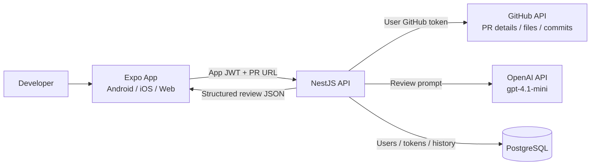

# CodeReviewPilot AI

AI-powered GitHub Pull Request review platform built with Expo, React Native, NestJS, Prisma, GitHub OAuth, and OpenAI.

## Apps

- `apps/mobile`: Expo app for Android, iOS, and Web.
- `apps/api`: NestJS backend API.

## Project Overview

For an English walkthrough that explains the product idea, architecture, trade-offs, security decisions, demo script, and talking points for job interviews, see [docs/project-overview.md](docs/project-overview.md).

For the reference specification/prompt used to recreate this project, see [docs/project-generation-prompt.md](docs/project-generation-prompt.md).

For versioned product changes, see [CHANGELOG.md](CHANGELOG.md).

## Features

- GitHub OAuth login and logout.
- Local GitHub CLI Auth and fine-grained PAT login for local/private repository workflows.
- Paste a GitHub PR URL like `https://github.com/owner/repo/pull/123`.
- Fetch PR metadata, changed files, commits, and patches from GitHub.
- Generate AI review sections: summary, critical issues, suggestions, security, performance, and best practices.
- Store review history in the backend and locally on the device.
- English and Thai UI with versioned release notes.
- Dark/light mode, a shared gradient app header, browser tab titles like `Home - CodeReviewPilot AI`, and a custom web favicon.
- Backend GitHub username allowlist and rate limiting for safer shared deployments.
- CI/CD with GitHub Actions that validates the monorepo and publishes API and mobile web Docker images to GitHub Container Registry.

## Architecture



Auth/token flow:

1. The user signs in with GitHub OAuth, a fine-grained PAT, or Local GitHub CLI Auth for local development.
2. The API validates the GitHub identity, applies the optional `GITHUB_ALLOWED_USERNAMES` allowlist, encrypts the GitHub token, and stores it server-side.
3. The API returns an app JWT to the frontend. The GitHub token is never returned to the mobile/web app.
4. Protected API calls send `Authorization: Bearer <app-jwt>`. The backend JWT guard resolves the user and uses the encrypted GitHub token only on the server.

## Requirements

- Node.js 20+
- PostgreSQL 15+
- Expo CLI through `npx expo`
- GitHub OAuth app
- OpenAI API key

## Setup

```bash
npm install
cp apps/api/.env.example apps/api/.env
cp apps/mobile/.env.example apps/mobile/.env
npm run prisma:generate -w apps/api
npm run prisma:migrate -w apps/api
```

Start the API:

```bash
npm run dev:api
```

Start the Expo app:

```bash
npm run dev:mobile
```

## Docker Compose

Run PostgreSQL, the API, and the Expo Web build together:

```bash
cp .env.example .env
# Fill the real secrets in .env before using GitHub/OpenAI flows.
docker compose up --build
```

The compose file starts:

- `postgres` on `localhost:5432`
- `api` on `http://localhost:3000`
- `mobile` on `http://localhost:8081`

The API container applies the Prisma schema with `prisma db push` on startup for local/demo convenience. Runtime secrets are read from `.env` or the deployment environment, not baked into Docker images. `GITHUB_TOKEN_ENCRYPTION_KEY` must be 32 bytes or a base64-encoded 32-byte value.

## Docker Images And CI/CD

GitHub Actions runs `CI/CD` on pull requests and pushes to `main`.

CI validates:

- dependency installation with `npm ci`
- Prisma client generation
- API and mobile lint
- API and mobile tests
- API build
- mobile TypeScript check

CD runs only after a successful push to `main` and publishes:

- `ghcr.io/ligerking007/codereviewpilotai-api`
- `ghcr.io/ligerking007/codereviewpilotai-mobile`

Both images are tagged as `latest` and with the commit SHA. GHCR is a container registry, not a hosting platform; a server or provider such as Render, Fly.io, Railway, or a VPS must pull and run the images with runtime environment variables.

The mobile image builds Expo Web static files with `expo export --platform web` and serves them with Nginx. PostgreSQL uses the official `postgres:18-alpine` image from Docker Hub.

For a real public deployment, replace local URLs with deployed domains:

```env
EXPO_PUBLIC_API_URL=https://api.example.com
APP_WEB_REDIRECT_URL=https://app.example.com/auth/callback
GITHUB_CALLBACK_URL=https://api.example.com/auth/github/callback
```

## GitHub OAuth

Create a GitHub OAuth app with:

- Homepage URL: `http://localhost:8081`
- Authorization callback URL: `http://localhost:3000/auth/github/callback`

Required repository permissions for the GitHub app/OAuth flow:

- Pull requests: Read
- Contents: Read
- Metadata: Read

For GitHub App installation tokens, set `GITHUB_APP_ID`, `GITHUB_APP_PRIVATE_KEY`, and `GITHUB_APP_WEBHOOK_SECRET`. The backend includes `GithubAppService` for creating app JWTs and installation access tokens.

## Fine-Grained Personal Access Token

For local development or users who do not want to configure OAuth, the app also supports GitHub fine-grained personal access tokens.

Create a token at GitHub Developer Settings with repository permissions:

- Metadata: Read
- Contents: Read
- Pull requests: Read

Then use the frontend "Fine-grained personal access token" form. The token is sent to the backend once, validated with GitHub, encrypted with AES-256-GCM, and stored server-side. The mobile app only stores the app JWT.

## Local GitHub CLI Auth

For local development only, the frontend also supports "Local CLI" login. The backend runs:

```bash
gh auth token
```

and uses that GitHub CLI token to create an app session. This gives the app the same GitHub identity as the machine running the backend. Do not use this as a production authentication method.

## Backend Access Controls

Set `GITHUB_ALLOWED_USERNAMES` to restrict who can create an app session. Leave it empty to allow any valid GitHub user, or set a comma-separated list:

```env
GITHUB_ALLOWED_USERNAMES="Ligerking007,JakapanK"
```

The API also applies a global IP-based rate limit. Defaults are `120` requests per `60000` ms and can be changed with:

```env
RATE_LIMIT_TTL_MS=60000
RATE_LIMIT_MAX=120
AI_REVIEW_RATE_LIMIT_TTL_MS=3600000
AI_REVIEW_RATE_LIMIT_MAX=5
```

AI review creation uses `AI_REVIEW_RATE_LIMIT_MAX` and `AI_REVIEW_RATE_LIMIT_TTL_MS` because it calls OpenAI.

## Production Security Considerations

- Encrypt GitHub tokens before storing them. This project uses AES-256-GCM through `GITHUB_TOKEN_ENCRYPTION_KEY`.
- Keep JWT guards on protected endpoints such as GitHub PR fetch, AI review creation, and history.
- Use `GITHUB_ALLOWED_USERNAMES` or an organization check when the deployment should not be public.
- Keep global and AI-review-specific rate limits enabled to reduce abuse and OpenAI cost exposure.
- Serve production traffic only over HTTPS.
- Disable Local GitHub CLI Auth in production; it is intended for local development on a trusted machine.
- Never expose `OPENAI_API_KEY`, GitHub OAuth client secret, database credentials, or token encryption keys in frontend environment variables.

## API Flow

1. Mobile opens `GET /auth/github`.
2. GitHub redirects to `GET /auth/github/callback`.
3. API exchanges the code, stores the encrypted GitHub access token, and redirects back to the Expo deep link with an app JWT.
4. Mobile calls `POST /ai-review/reviews` with a PR URL.
5. API fetches GitHub PR data and asks OpenAI to generate structured review output.

## Tests

```bash
npm test
```

Web


Mobile


