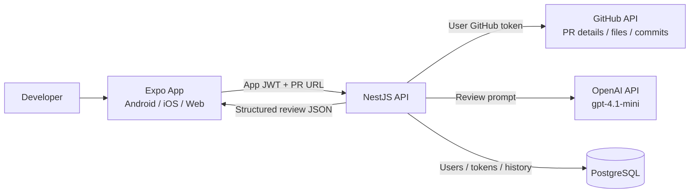

# Architecture

CodeReviewPilot AI uses a small monorepo with separated delivery concerns.

## System Diagram

## Auth And Token Flow

1. The user signs in through GitHub OAuth, a fine-grained PAT, or Local GitHub CLI Auth for local development.
2. The backend validates the GitHub identity and optionally checks `GITHUB_ALLOWED_USERNAMES`.
3. The GitHub token is encrypted with AES-256-GCM and stored server-side.
4. The backend issues an app JWT containing the internal user id and GitHub username.
5. The frontend stores only the app JWT and sends it as a bearer token for protected requests.
6. The backend JWT guard verifies each protected request and loads the server-side GitHub token when it needs to call GitHub.

## Frontend

The Expo app owns presentation, local settings, local history cache, authentication token storage, language selection, theme selection, and app metadata display.

Key folders:

- `src/screens`: feature screens.
- `src/components`: reusable UI primitives.
- `src/constants`: app metadata such as name, version, developer, and release notes.
- `src/services`: API client and storage adapters.
- `src/i18n`: English and Thai translations.
- `src/theme`: light/dark color tokens.

The shared `Screen` layout renders the gradient app header on every page. It includes the app identity, theme toggle, language toggle, and history shortcut. The Home screen also shows app version, developer name, and collapsible versioned release notes.

## Backend

The NestJS API owns authentication, GitHub integration, AI review generation, and database persistence.

Modules:

- `auth`: GitHub OAuth, JWT issuance, logout.
- `users`: user account lookup and token storage.
- `github`: PR URL parsing and GitHub API integration.
- `github-app.service`: GitHub App JWT and installation token support.
- `ai-review`: OpenAI prompt construction and structured review generation.
- `history`: review history retrieval.

The API uses a global throttler guard for IP-based rate limiting. AI review creation has a tighter route-level throttle because it calls OpenAI. Login also supports a GitHub username allowlist through `GITHUB_ALLOWED_USERNAMES`; disallowed accounts are rejected before their GitHub token is stored.

## Database

Prisma models:

- `users`
- `github_accounts`
- `review_history`
- `review_results`
- `github_installations`

GitHub tokens are encrypted before storage with AES-256-GCM.
