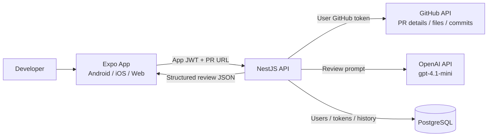
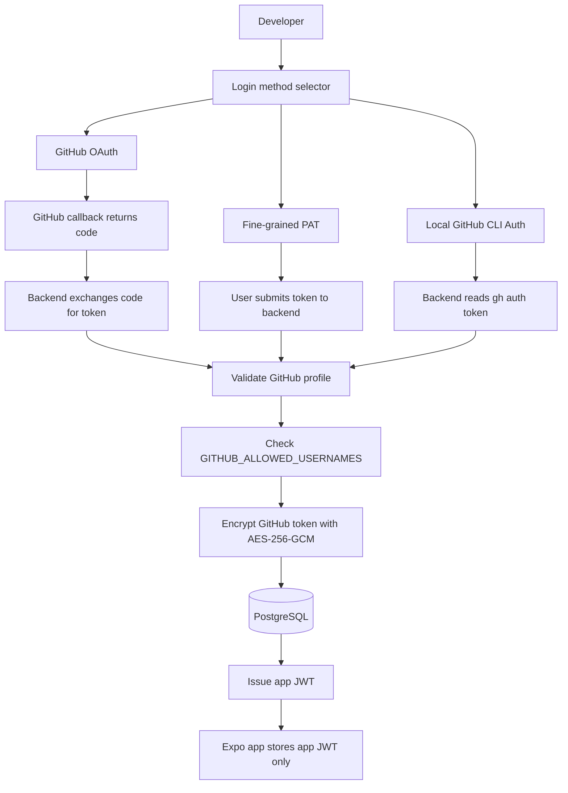
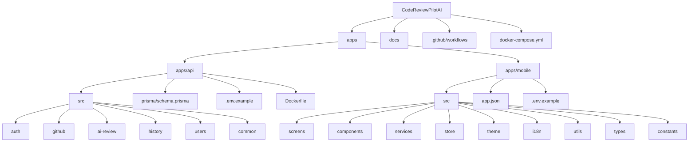
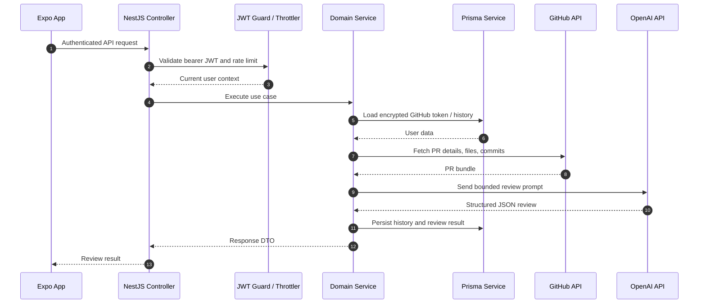
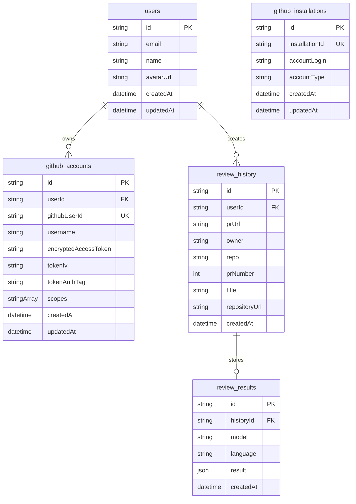
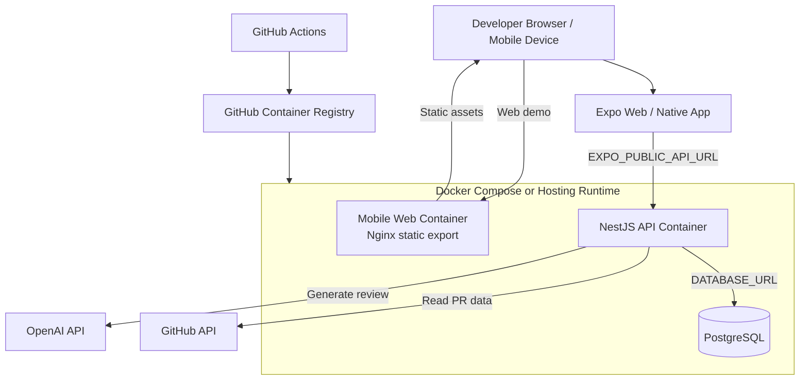

# Architecture

CodeReviewPilot AI uses a small monorepo with separated delivery concerns.

## System Diagram

## Auth And Token Flow

1. The user signs in through GitHub OAuth, a fine-grained PAT, or Local GitHub CLI Auth for local development.
2. The backend validates the GitHub identity and optionally checks `GITHUB_ALLOWED_USERNAMES`.
3. The GitHub token is encrypted with AES-256-GCM and stored server-side.
4. The backend issues an app JWT containing the internal user id and GitHub username.
5. The frontend stores only the app JWT and sends it as a bearer token for protected requests.
6. The backend JWT guard verifies each protected request and loads the server-side GitHub token when it needs to call GitHub.

### Auth Method Comparison

## Frontend

The Expo app owns presentation, local settings, local history cache, authentication token storage, language selection, theme selection, and app metadata display. For container deployment, the mobile app is exported as a static Expo Web build and served by Nginx.

## Code Structure

### Backend Folder Responsibilities

- `auth`: GitHub OAuth, fine-grained PAT login, Local CLI Auth, JWT session handling, allowlist enforcement, and token encryption.
- `github`: PR URL parsing, GitHub REST API calls, PR bundle construction, and GitHub App installation token support.
- `ai-review`: OpenAI prompt construction, review generation, Zod validation, and review result normalization.
- `history`: Review history retrieval for the authenticated user.
- `users`: User profile and GitHub account persistence.
- `common`: Prisma service, current-user decorator, and shared backend types.
- `prisma`: PostgreSQL schema for users, GitHub accounts, installations, review history, and review results.

### Frontend Folder Responsibilities

- `screens`: Home, Result, History, and Auth callback screens.
- `components`: Shared UI primitives such as `Screen`, `Button`, `Section`, and `IssueCard`.
- `services`: API client functions and local/secure storage adapters.
- `store`: Auth context, app JWT state, and derived display identity such as GitHub username.
- `theme`: Dark, light, and system theme context and color tokens.
- `i18n`: English and Thai translation resources.
- `utils`: PR URL validation and session token parsing helpers with unit tests.
- `types`: Navigation and review response TypeScript types.
- `constants`: App metadata such as app name, version, developer name, and versioned release notes.

The shared `Screen` layout renders the gradient app header on every page. It includes the app identity, theme toggle, language toggle, and history shortcut. The Home screen also shows app version, developer name, and collapsible versioned release notes.

## Backend

The NestJS API owns authentication, GitHub integration, AI review generation, and database persistence.

Modules:

- `auth`: GitHub OAuth, JWT issuance, logout.
- `users`: user account lookup and token storage.
- `github`: PR URL parsing and GitHub API integration.
- `github-app.service`: GitHub App JWT and installation token support.
- `ai-review`: OpenAI prompt construction and structured review generation.
- `history`: review history retrieval.

The API uses a global throttler guard for IP-based rate limiting. AI review creation has a tighter route-level throttle because it calls OpenAI. Login also supports a GitHub username allowlist through `GITHUB_ALLOWED_USERNAMES`; disallowed accounts are rejected before their GitHub token is stored.

### Backend Request Flow

## Test Coverage Focus

The unit tests focus on code paths that protect product reliability and security:

- `auth/token-crypto.service.spec.ts`: verifies GitHub token encryption/decryption, random IV usage, and invalid encryption key handling.
- `auth/github-allowlist.spec.ts`: verifies case-insensitive allowlist parsing and rejection behavior.
- `github/pr-url.spec.ts`: verifies PR URL parsing before the backend calls GitHub.
- `ai-review/review-result.schema.spec.ts`: verifies AI output normalization so incomplete model responses still render safely.
- `ai-review/ai-review.service.spec.ts`: verifies prompt language selection, PR metadata inclusion, binary patch fallback, and per-file patch size limits.
- Mobile utility tests verify PR URL validation, app metadata/release-note consistency, and GitHub username extraction from the app JWT payload.

## Database

Prisma models:

- `users`
- `github_accounts`
- `review_history`
- `review_results`
- `github_installations`

GitHub tokens are encrypted before storage with AES-256-GCM.

### Database ER Diagram

## Container Deployment

Local Docker Compose runs three services:

- `mobile`: Expo Web static files served by Nginx on `localhost:8081`.
- `api`: NestJS API on `localhost:3000`.
- `postgres`: PostgreSQL on `localhost:5432`.

The API connects to PostgreSQL through the Docker network hostname `postgres`. The browser talks to the API through `EXPO_PUBLIC_API_URL`, which defaults to `http://localhost:3000` for local Compose.

CI/CD publishes two project images to GitHub Container Registry after successful pushes to `main`:

- `ghcr.io/ligerking007/codereviewpilotai-api`
- `ghcr.io/ligerking007/codereviewpilotai-mobile`

The database uses the official `postgres:18-alpine` image. GHCR stores images only; a runtime host must pull the images, provide secrets and environment variables, and run the containers.

Runtime secrets such as `OPENAI_API_KEY`, `JWT_SECRET`, `GITHUB_CLIENT_SECRET`, and `GITHUB_TOKEN_ENCRYPTION_KEY` are passed through environment variables. They are not committed to Git and are not baked into Docker images.

### Deployment Diagram

