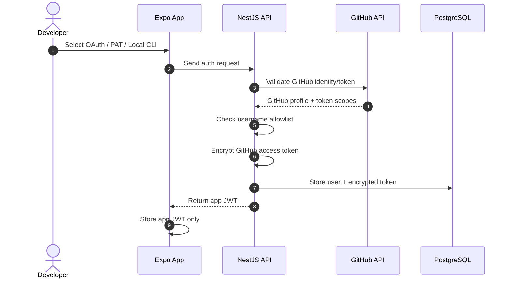
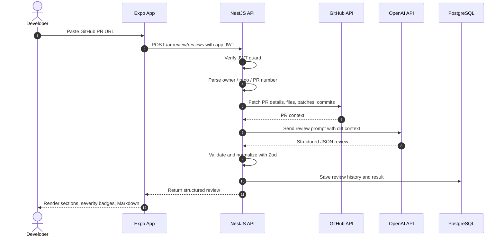
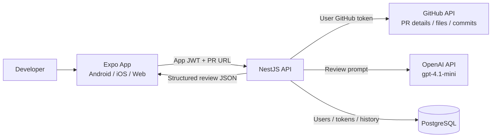
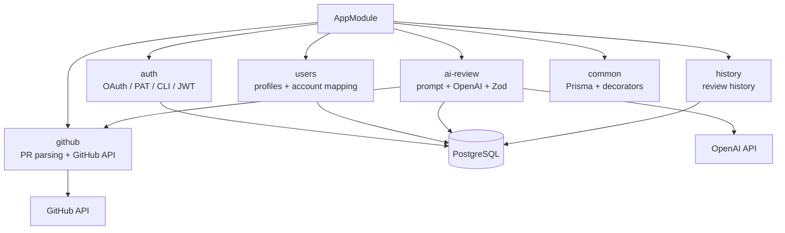

# CodeReviewPilot AI - Project Overview

This document explains CodeReviewPilot AI at a level suitable for interviews, portfolio reviews, and technical walkthroughs.

## Elevator Pitch

CodeReviewPilot AI is an AI-powered GitHub Pull Request review platform. Users sign in with GitHub, paste a PR URL, and the system fetches PR details, changed files, patches, and commits from GitHub. The backend then sends the relevant PR context to OpenAI and generates structured review feedback, including bug risks, security warnings, performance concerns, architecture issues, and best-practice recommendations.

The goal is not to replace human reviewers. The goal is to help reviewers find risky areas faster, make code review more consistent, and give developers actionable feedback before merging.

## Problem Statement

Code review is important, but teams often face common problems:

- Reviewers have limited time and can miss edge cases.
- Large pull requests are difficult to understand quickly.
- Security, performance, and async/concurrency issues are not always reviewed consistently.
- Junior developers benefit from clear, structured, and actionable feedback.

CodeReviewPilot AI addresses these problems by combining GitHub API data with an AI review engine that summarizes risks and groups feedback into useful review categories.

## User Flow

1. The user opens CodeReviewPilot AI.
2. The user logs in with GitHub OAuth, a fine-grained PAT, or Local GitHub CLI Auth during local development.
3. The user pastes a GitHub Pull Request URL, for example `https://github.com/owner/repo/pull/123`.
4. The backend validates the URL and extracts `owner`, `repo`, and `prNumber`.
5. The backend uses the user's GitHub access token to fetch PR details, changed files, patches, and commits.
6. The backend builds an AI prompt from the PR context and sends it to OpenAI using `gpt-4.1-mini`.
7. OpenAI returns a structured JSON review result.
8. The backend stores the review history in the database.
9. The frontend displays the result with expandable sections, severity badges, file references, Markdown rendering, and a copy button.

## Visual Flow Diagrams

### Authentication And Token Flow

### Pull Request Review Flow

## Architecture Overview

The project is organized as a monorepo with two main applications:

- `apps/mobile`: React Native + Expo frontend for Android, iOS, and Web.
- `apps/api`: NestJS backend API for authentication, GitHub integration, AI review, and persistence.

### Backend Module Map

The frontend uses a shared app shell with a gradient header, browser page titles such as `Home - CodeReviewPilot AI`, a custom web favicon, language/theme/history actions, and a Home screen metadata panel that shows app version, developer name, and collapsible release notes.

For detailed code structure and folder responsibilities, see [architecture.md](architecture.md#code-structure).

Backend modules:

- `auth`: GitHub OAuth, JWT session handling, and token encryption.
- `users`: User profile and GitHub account mapping.
- `github`: PR URL parsing, GitHub API integration, and GitHub App token support.
- `ai-review`: Prompt construction, OpenAI integration, and structured schema validation.
- `history`: Review history retrieval.
- `common`: Shared Prisma service, decorators, and common types.

Database tables:

- `users`
- `github_accounts`
- `github_installations`
- `review_history`
- `review_results`

## Why This Tech Stack

### React Native + Expo

Expo allows the frontend to support Android, iOS, and Web from one TypeScript codebase. This is a good fit for a developer tool because users may want to review PRs from a browser during work or from a mobile device when they are away from their desk.

### NestJS

NestJS provides a clear modular architecture and dependency injection. That makes the backend easier to scale because each domain, such as authentication, GitHub integration, AI review, and history, has its own module.

### Prisma

Prisma keeps the database schema, migrations, and TypeScript types aligned. It reduces the risk of runtime database errors and makes model relationships easier to understand.

### OpenAI `gpt-4.1-mini`

`gpt-4.1-mini` is used because it provides a practical balance of quality, latency, and cost for code review assistance. The model is configured through `OPENAI_MODEL`, so it can be changed without rewriting the application logic.

## Security Considerations

The project includes several security-focused design choices:

- GitHub access tokens are encrypted before being stored in the database using AES-256-GCM.
- The frontend stores the app JWT in SecureStore on native platforms and localStorage on Web.
- Protected backend endpoints use a bearer JWT guard.
- GitHub access tokens stay on the server and are never returned to the frontend.
- GitHub permissions are limited to read-only access for pull requests, contents, and metadata.
- The AI prompt only includes PR context needed for review.
- `GITHUB_ALLOWED_USERNAMES` can restrict which GitHub accounts may create sessions.
- Global API rate limiting reduces abuse, and AI review creation has a stricter throttle because it consumes OpenAI quota.

Production improvements I would add:

- Secret scanning and redaction before sending diffs to AI.
- Per-user and per-repository rate limiting beyond the current IP-based limits.
- GitHub webhook signature verification.
- Token rotation and revocation handling.
- Audit logs for review requests.

## AI Review Engine Design

The AI review engine does not return unstructured text directly to the UI. Instead, it asks the model to return JSON and validates that result with Zod.

The response schema includes:

- `summary`
- `criticalIssues`
- `suggestions`
- `security`
- `performance`
- `bestPractices`
- `markdown`

This design has several advantages:

- The frontend can render the result predictably.
- Issues can be grouped by section, severity, or file.
- Review history can be stored and queried consistently.
- The UI does not depend on fragile Markdown parsing for core data.

The prompt asks the model to focus on code quality, possible bugs, security issues, performance concerns, architecture and design, missing validation, async/concurrency risks, logging, and error handling.

## Important Trade-offs

### Diff Size Limiting

The backend limits how much patch content is sent to the model to control token usage, latency, and cost. The trade-off is that very large PRs may not be analyzed fully in a single request. A production version should split large diffs into chunks and summarize them with a map-reduce style workflow.

### OAuth First, GitHub App Ready

The current flow uses GitHub OAuth first because it is straightforward for user-based access, including private repositories. The backend also includes `GithubAppService` so the project can support GitHub App installation tokens later, which is better for organization-level and repository-scoped permissions.

### Local + Remote History

The frontend caches recent reviews locally for a faster user experience. The backend also stores review history so the data can be synced across devices.

### Container Registry Versus Runtime Hosting

The CI/CD pipeline publishes API and mobile web Docker images to GitHub Container Registry:

- `ghcr.io/ligerking007/codereviewpilotai-api`
- `ghcr.io/ligerking007/codereviewpilotai-mobile`

GHCR stores versioned deployment artifacts, but it does not run the application. A hosting provider or server must pull those images, inject runtime secrets such as `OPENAI_API_KEY`, `JWT_SECRET`, and `DATABASE_URL`, and run the containers. PostgreSQL can run from the official `postgres:18-alpine` image for local demos or VPS deployments, but a managed database such as Neon, Supabase, Render PostgreSQL, or Railway PostgreSQL is a better fit for production.

The mobile image is an Expo Web static export served by Nginx. The API image is a NestJS server. They are intentionally split so frontend, backend, and database lifecycles can be deployed, restarted, and scaled independently.

## What I Would Improve Next

For a production version, I would add:

- GitHub App installation onboarding.
- Webhooks for automatic review when a PR is opened or updated.
- Inline GitHub review comments posted back to the PR.
- Diff chunking and file prioritization for large pull requests.
- Secret redaction before sending code to the AI model.
- A background job queue, such as BullMQ and Redis, for long-running reviews.
- Observability with structured logs, tracing, and metrics.
- Role-based access control for teams.
- Integration tests with mocked GitHub and OpenAI APIs.
- Production deployment setup with managed PostgreSQL, hosted API, hosted frontend, and environment-specific domains.

## How To Explain This In An Interview

Short explanation:

“I built CodeReviewPilot AI as a full-stack AI pull request review assistant. The frontend is built with Expo so it can run on Android, iOS, and Web. The backend is built with NestJS and separated into modules such as auth, github, ai-review, and history. After a user logs in with GitHub, they paste a PR URL. The backend validates the URL, fetches PR details and diffs through the GitHub API, builds an AI prompt, and asks OpenAI to return a structured JSON review. The result is validated with Zod, stored in the database, and rendered in the frontend as organized review sections.”

If asked about security:

“The GitHub token is never sent back to the frontend. The backend issues an app JWT to the client, while the GitHub access token is encrypted with AES-256-GCM before being stored. The token is only used server-side to call the GitHub API.”

If asked about scalability:

“The current implementation uses a synchronous request flow because it is simple for an MVP and demo. The module boundaries make it straightforward to move AI review generation into a background worker later, using something like BullMQ, Redis, and separate review jobs for large PRs.”

If asked about AI reliability:

“The AI response is not treated as free-form text. I require structured JSON and validate it with Zod before saving or rendering it. This makes the UI predictable and reduces the chance of broken output formats.”

## Demo Script

1. Open the app and explain that Expo supports Android, iOS, and Web.
2. Click Login with GitHub to show the OAuth flow.
3. Paste a GitHub PR URL and start a review.
4. Explain that the backend parses the URL and fetches PR data from GitHub.
5. Open the result screen and show sections, severity badges, file references, Markdown rendering, and the copy button.
6. Open the history screen to show local and backend review history.
7. Open the backend folder and explain the NestJS module structure.
8. Open the Prisma schema and explain the database design.
9. Open the AI review service and explain prompt construction plus schema validation.
10. Open the CI/CD workflow and Dockerfiles to show how the API and mobile web images are built and published.

## Key Files To Show

- `apps/api/src/app.module.ts`: Backend module overview.
- `apps/api/src/github/pr-url.ts`: PR URL validation logic.
- `apps/api/src/github/github.service.ts`: GitHub API integration.
- `apps/api/src/github/github-app.service.ts`: GitHub App installation token support.
- `apps/api/src/ai-review/ai-review.service.ts`: OpenAI review workflow.
- `apps/api/src/ai-review/review-result.schema.ts`: Structured AI output schema.
- `apps/api/prisma/schema.prisma`: Database design.
- `apps/mobile/src/screens/HomeScreen.tsx`: PR input flow.
- `apps/mobile/src/screens/ResultScreen.tsx`: Review result UI.
- `apps/mobile/src/i18n/locales/en.ts`: English translation support.
- `apps/api/Dockerfile`: Production API image.
- `apps/mobile/Dockerfile`: Expo Web static image served by Nginx.
- `.github/workflows/ci-cd.yml`: CI validation and GHCR image publishing.
- `docker-compose.yml`: Local three-service stack for mobile, API, and PostgreSQL.
